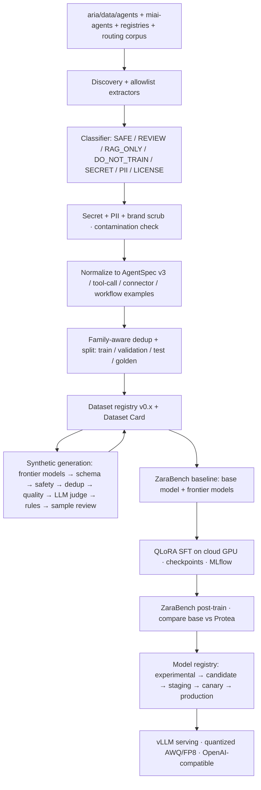

# Protea v0 — Architecture Proposal

**Date:** 2026-09-06 · **Status:** proposed (Phase 0) · **Depends on:** `repository-audit.md`, `data-risk-assessment.md`

## 1. Where Protea lives

**Decision:** build the model platform as a Python package `protea/` inside `MalcolmGov/aria`, with the GPU-bound pieces (training, inference server) packaged as separate containers that never run on the Hetzner VPS.

Why `aria`, not `Gaslite` or a new repo:

- `aria` is Python/FastAPI with pytest, a CI test gate, and a deploy pipeline; Protea's data pipeline, validators, registries and router are Python and slot into the same conventions (`pytest.ini`, `requirements.txt`, `ci-tests.yml`).
- The consumers of Protea (`embed/`, `agent_platform/`, `llm/`, `agent_runtime/`) are all there. A separate repo would force cross-repo schema versioning on day one.
- The catalogue (`data/agents/`) and registries the extractors read are there, so dataset provenance is `source_commit` of the same repo.
- `Gaslite` is an unrelated product. These Phase 0 documents are committed here only because this is the designated branch; they should be copied to `aria/docs/` when Phase 1 starts.

Layout (adapting §6 of the brief to `aria` conventions):

```
aria/
├── protea/                        # importable package, pure Python, CPU-testable
│   ├── __init__.py
│   ├── cli.py                     # `protea …` (Typer; the repo already uses argparse/Typer-style tools)
│   ├── config/                    # pydantic-settings; YAML loaders for models/, training/, inference/, evaluation/
│   ├── schemas/                   # canonical AgentSpec v3 (Pydantic) + JSON Schema export, dataset example schema
│   ├── providers/                 # ModelProvider interface + adapters (zaralm, anthropic, openai, google, azure, openai_compatible, mock)
│   ├── router/                    # task classifier, complexity, policy, capability matrix, fallback, confidence
│   ├── compiler/                  # Agent Compiler pipeline (wraps agent_platform.compiler + embed registries)
│   ├── context/                   # Model Context Builder (relevant tools/skills/connectors/schemas only)
│   ├── data_pipeline/             # discovery, extractors, classifiers, secrets, pii, dedup, normalization, synthetic, validation, exporters
│   ├── registry/                  # dataset registry, model registry, experiment tracking (MLflow client or file-backed)
│   ├── evaluation/                # ZaraBench: tasks, evaluators, scorers, reports, golden-set guard
│   ├── training/                  # SFT/LoRA/QLoRA trainers (TRL + PEFT), callbacks, checkpoint/resume, remote job adapters
│   ├── inference/                 # vLLM launch config, structured-output helpers, health, OpenAI-compatible client
│   ├── observability/             # metrics/tracing hooks, privacy-safe logging, feedback linkage
│   └── security/                  # policies (tool risk, tenant isolation), scanning rules, audit
├── protea_data/                   # versioned datasets + manifests + cards (git-lfs or object storage; golden/ is read-only)
├── configs/                # YAML: models/, training/, inference/, evaluation/
├── deployment/protea/             # Dockerfile.train, Dockerfile.infer (vLLM), compose.gpu.yml, runpod/, azure/ (Bicep), k8s/
├── docs/                   # README, architecture, adr/, model-selection, data-governance, …
└── tests/protea/                  # unit + integration (mock provider) + security tests
```

## 2. Integration points (reuse, do not rewrite)

| Protea component | Reuses from `aria` | Change required |
|---|---|---|
| **ModelProvider abstraction** | `llm/*_provider.py` (Claude, OpenAI, Gemini), `server.py::_cost_aware_complete` (Ollama tiers), `embed/llm.py` (fixed-model + usage_out), `commands/admin.log_api_usage` (cost table) | New `protea/providers/base.py` interface (`generate`, `stream`, `generate_structured`, `health`) with adapters that *wrap* the existing provider modules; `ProteaProvider` speaks OpenAI-compatible HTTP to vLLM. `embed/llm.reply` and `copilot.py` migrate to it behind a feature flag (`ZARALM_PROVIDER_LAYER=1`). |
| **Catalogue runtime (TypeScript)** | `agent_runtime/packages/runtime` `GatewayModelAdapter` | None for v0: `MIAI_MODEL_MODE=gateway`, `MIAI_MODEL_GATEWAY_URL=<vllm>/v1` serves catalogue agents from Protea. Add `MODEL_MAP` alias `protea-agent`. |
| **Agent Compiler** | `agent_platform/copilot._diagnose_and_architect_solution` (pipeline), `agent_platform/compiler.compile_agent_specification` (17-facet schema), `dependencies`, `dna`, `requirements` (+`nbq`), `connectors.detect_archetype`, `embed/agentspec`, `embed/agent_builder_v2` | `protea/compiler/` orchestrates the same stages; Protea (or a frontier provider) replaces the keyword steps: requirement understanding, objective extraction, capability planning, workflow generation, guardrail generation. Deterministic stages (dependency graph, registries, validation, readiness) stay deterministic. Output lands as a **draft** deployment, never `live`. |
| **Requirement Completeness Engine** | `agent_platform/requirements.RequirementsGraph` + `nbq` | Extend the confidence matrix with the §30 fields (trigger, inputs, outputs, approvals, escalations, frequency, success criteria); expose `{score, missing[], can_generate}`. |
| **Schema** | `agent_platform/compiler.AgentSpecification` (17 facets), `embed/agentspec.AgentSpec` | Define `AgentSpec v3` in `protea/schemas/` covering §45 blocks; provide lossless converters to both existing shapes and to `zara.agent-package/v1` so nothing downstream breaks. JSON Schema exported for constrained decoding. |
| **Tool / connector / skill registries** | `embed/tool_registry`, `embed/skills_registry`, `embed/connectors_v2`, `agent_runtime` connectors + presets | Registry *readers* in `protea/context/`; add missing §41 fields (`risk`, `requires_confirmation`, `required_permissions`, `tenant_scoped`, `audited`) as defaults where absent. Registry becomes the single source the context builder and validators use. |
| **Workflow** | `embed/workflow_engine.WorkflowStep` node types, `compiler.WorkflowNode` | Workflow-generation dataset targets the `WorkflowStep` schema (trigger/agent/tool/condition/approval/wait/end); add `retry`, `timeout`, `compensation`, `loop` fields in v3. |
| **Validation gate** | `miai-agents/tools/validate.py`, `scripts/marketplace/validate_package.py`, `compiler.ReadinessScore` | `protea/compiler/validate.py`: JSON Schema → business rules → security rules (tool risk vs autonomy) → connector exists → tool exists → deployment eligibility. |
| **Evaluation** | `agent_runtime/scripts/run-evals.mjs`, `miai-agents/tools/run_evals.py` (LLM judge, repeat voting), `agents/*/evals.jsonl` expectation grammar | ZaraBench reuses the `expect` grammar for tool-calling tasks and the Python harness structure; adds schema-validity, workflow-validity, hallucination and safety scorers and the weighted `ZaraScore`. |
| **Observability** | Sentry, `api_usage` table (tokens, cost, latency, model, channel, user), `audit_events`, `ROUTE` logs | Add request_id/model_version/validation_result/fallback columns; privacy-safe logging default; feedback table linked to model version (§36–§37). |
| **Security** | Bearer/pak_/aps_ auth, `partner_id` scoping, `cryptox`, guardrails regexes, `security_pack.py` | Protea inference endpoint is internal-only (token + private network); tool execution remains deterministic application logic in `embed/actions.py` and the runtime. |
| **Deployment** | Docker Compose on Hetzner, Railway, GitHub Actions deploy gate | GPU services are new: `deployment/protea/` (RunPod template, Azure Bicep for NC-series/Container Apps GPU, generic SSH). The VPS only hosts the router/provider layer and calls out. |

## 3. Runtime request path (v0)

```mermaid
flowchart LR
  U[Console / Voice Copilot / Embed] --> RC[Requirement Collector\nRequirementsGraph + completeness]
  RC --> AC[Agent Compiler]
  AC --> CB[Context Builder\nrelevant tools · skills · connectors · schema]
  CB --> MR[Model Router\ntask · complexity · privacy · cost · capability]
  MR -->|zaralm| Z[Protea via vLLM\nOpenAI-compatible, JSON-schema constrained]
  MR -->|frontier| F[Anthropic / OpenAI / Google / Azure]
  Z --> V[Validation gate\nschema → rules → security → connectors → tools → eligibility]
  F --> V
  V -->|pass| D[Draft AgentSpec v3 → agent_platform.store]
  V -->|fail| FB[Fallback: frontier model → re-validate]
  FB --> V
  V --> O[Observability\nrequest_id · model_version · validation · fallback · cost]
  FB --> O
  O --> FE[Fallback events → review queue → dataset candidates]
```



## 4. Training path (v0)



## 5. Provider interface (Python, mirrors §3.2)

```python
class GenerationRequest(BaseModel):
    messages: list[Message]; tools: list[ToolSchema] | None = None
    response_schema: dict | None = None      # JSON Schema for constrained decoding
    max_tokens: int = 1024; temperature: float = 0.2
    metadata: RequestMeta                     # request_id, tenant_ref (hashed), agent_id, task_type

class ModelProvider(Protocol):
    name: str; model_id: str
    async def generate(self, req: GenerationRequest) -> GenerationResponse: ...
    async def stream(self, req: GenerationRequest) -> AsyncIterator[ModelChunk]: ...
    async def generate_structured(self, req: GenerationRequest, schema: type[T]) -> T: ...
    async def health(self) -> ModelHealth: ...
```

Adapters: `ProteaProvider` (vLLM `/v1/chat/completions` with `response_format`/guided JSON), `AnthropicProvider`, `OpenAIProvider`, `GoogleProvider`, `AzureOpenAIProvider`, `OpenAICompatibleProvider` (Ollama, gateways), `MockProvider` (tests). Every call records usage through the existing `log_api_usage` path with `model_version` added.

## 6. Model Router and fallback (v0 scope)

- Inputs: `task_type` (agent_generation, workflow_generation, tool_select, connector_select, repair, optimize, chat), complexity estimate (input length, connector count, financial actions), privacy flag (tenant setting), cost policy, capability matrix (ZaraBench category scores per model version), latency budget, availability.
- Policy: Protea is eligible only for task types where its ZaraBench category score ≥ threshold (config). Everything else routes to the configured frontier provider. Version pinning per agent (`provider:zaralm`, `model:protea-agent-0.1`) honoured (§57).
- Fallback: Protea → validate → on failure frontier → validate; every fallback recorded (`fallback=true`, reason). Canary percentage is a config value evaluated per tenant hash (§56).
- Confidence: computed from schema validity, validator outcomes, tool/connector existence, retrieval coverage, benchmark category score and historical success rate — never from model self-report (§34).

## 7. Serving

- **Engine:** vLLM (OpenAI-compatible, guided JSON via `response_format`/outlines/xgrammar, LoRA adapter hot-loading, AWQ/FP8 quantization). ADR-001 will record alternatives (TGI, SGLang, llama.cpp for edge).
- **Endpoints:** `/v1/chat/completions` (vLLM native) plus Zara-specific FastAPI facade in `aria` (`/v1/agent/generate`, `/v1/agent/repair`, `/v1/agent/optimize`, `/v1/workflow/generate`, `/v1/tools/select`) that runs the compiler + validation gate around the model.
- **Hosting:** RunPod (pods or serverless) for v0 experiments, Azure NC-series/Container Apps GPU for the partner-facing path (Bicep generated, not applied), generic SSH GPU box adapter. The Hetzner VPS (4 GB RAM) cannot host inference.

## 8. Security architecture for Protea

- Inference endpoint private (token + allowlisted egress from the VPS); no tenant documents leave the RAG layer.
- Model output is data: tool calls pass the deterministic risk/approval path (`tool_registry.requires_approval`, `approval_center`) before execution.
- Prompt construction separates system / developer / user / retrieved / tool-output segments with explicit delimiters and injection tests in ZaraBench Safety.
- Training data access: `protea_data/` readable by the pipeline only; golden set write-protected and hash-pinned in CI.
- Artifact access: model registry entries carry SHA-256 of adapters and configs; downloads gated by RBAC on the console.

## 9. Architecture decisions to record as ADRs in Phase 1

| ADR | Decision (proposed) |
|---|---|
| ADR-001 model serving | vLLM with OpenAI-compatible API and guided JSON |
| ADR-002 training framework | Hugging Face TRL + PEFT (QLoRA via bitsandbytes), Unsloth optional for speed; Axolotl considered |
| ADR-003 dataset format | JSONL chat-messages with tool-call blocks (OpenAI function-call shape) + per-example metadata envelope |
| ADR-004 model routing | Policy table + capability matrix from ZaraBench, canary by tenant hash |
| ADR-005 model registry | File/JSON registry versioned in git + MLflow model registry when available |
| ADR-006 Protea location | `protea/` package, GPU containers separate |
| ADR-007 AgentSpec v3 | Pydantic v3 schema with converters to package v1, AgentSpec v2 and 17-facet spec |
